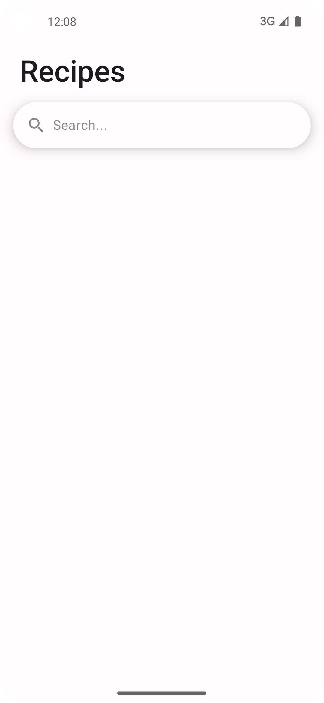
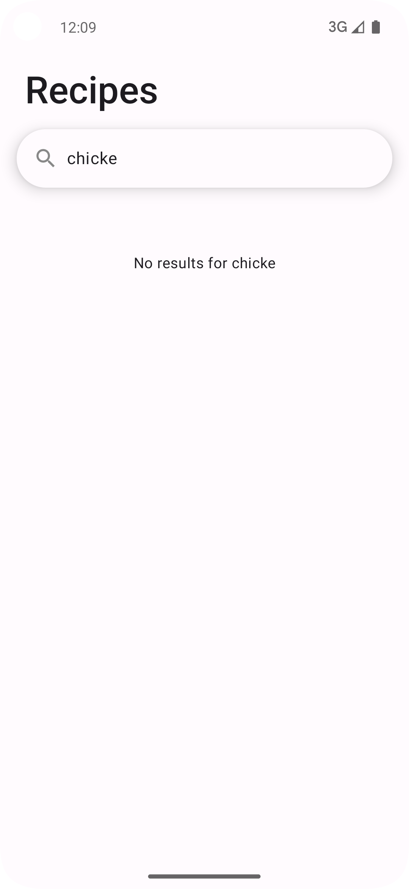
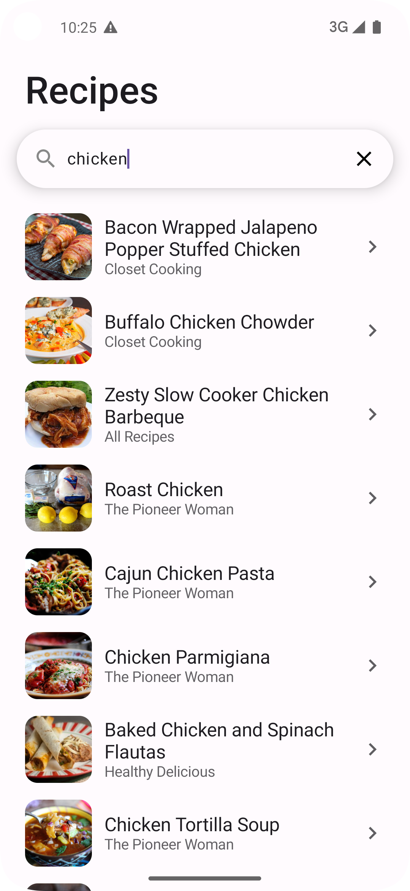
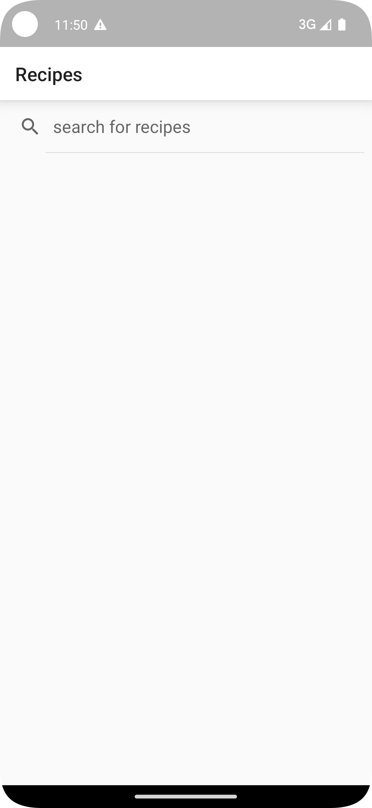
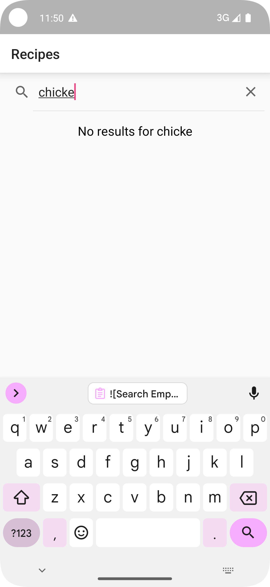
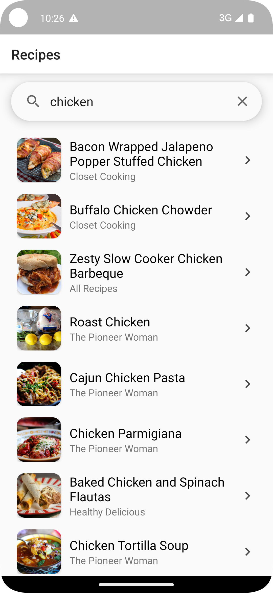
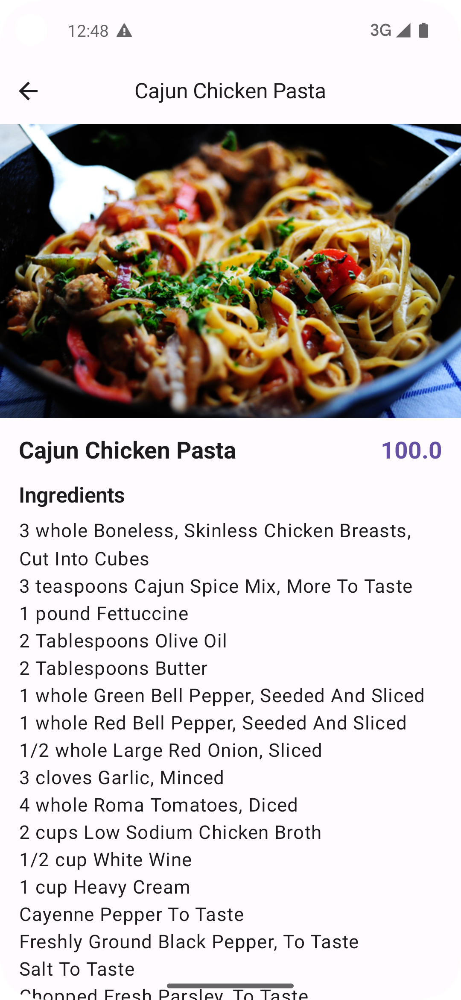
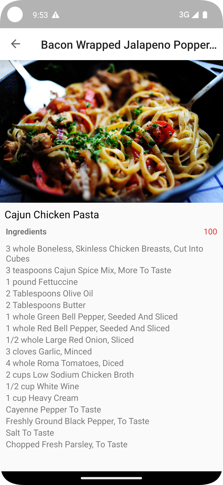

# SiriusXM Android Take-Home Project

Welcome to the SiriusXM Android take-home project! This exercise is designed to evaluate your skills
in Android development. Please spend **no more than 4-6 hours** working on this project. We will evaluate whatever you're able to complete.

A great solution should show:

- A strong grasp of software patterns (e.g., MVVM, repository pattern)
- Best practices for Android development, including code readability and maintainability
- Thoughtful approaches to error handling, user experience, and performance

In the in-person interview, you should be prepared to walk through your code and discuss your
thought process.

## Project Setup

### Development Environment

- **Android Studio Requirements:** 
  - Ladybug (2024.2.1)
  - AGP version 8.7
  - Gradle version 8.11
- **Frameworks**:
    - You can use either Views or Compose. While most new code is written in Compose, we maintain
      legacy Views, so it is a plus if engineers are comfortable working with both frameworks.
    - For **Compose**, use the `app-compose` module and configuration.
    - For **Views**, use the `app-view` module and configuration.

## Product Requirements

### 1. Search Screen

The search screen enables users to search for recipes and view results.

- **Input Field**: Display a search input field at the top of the screen.
- **Search Logic**:
    - If the query is empty, display a blank screen.
    - Show a **loading widget** while search results are loading.
    - If no results are returned, display the message: **"No results for {query}"**.
    - If results are returned, display them in a list. Clicking an item should navigate to the
      details screen.
    - **Debounce** the search input by 300ms to limit API calls and improve performance.
- **UI Design**: Match the layout in these screenshot as closely as possible:

|         | Empty State                                                | No Results                                               | Results                                                   |
|---------|------------------------------------------------------------|----------------------------------------------------------|-----------------------------------------------------------|
| Compose |  |  |  |
| Views   |     |     |     |

### 2. Details Screen

The details screen displays more information about a recipe.

- **Loading Widget**: Display a loading widget while the recipe details are loading.
- **UI Design**: Match the layout in this screenshot as closely as possible:

| Compose                                             | View                                          |
|-----------------------------------------------------|-----------------------------------------------|
|  |  |

## Tasks

Select either views or compose, but not a combination.

In its initial state, the project will compile, and display a blank Recipes screen. See the TODOs in the code.

### Views

1. In RecipeSearchViewModel.kt: Return a StateFlow of search results using the searchRepository. The
   screen should show a blank page when the query is empty, a loading widget while the page is
   loading, and a list of results when the repository returns data. See the screenshots in
   /screenshots.
2. In RecipeSearchFragment.kt: Display search results from RecipeSearchViewModel. It should
   match the image in [screenshots/view_search_results.png](screenshots/view_search_results.png)
3. In RecipeDetailViewModel.kt: Implement a ViewModel for the details screen using the
   detailsRepository.
4. In RecipeDetailFragment.kt: Populate the page seen in fragment_recipe_detail.xml. See the
   screenshot at [screenshots/view_details.png](screenshots/view_details.png)

### Compose

1. In SearchViewModel.kt: Implement the search screen's ViewModel. The screen should show a blank
   page when the query is empty, a loading widget while the page is loading, and a list of results
   when the repository returns data. See the screenshots in /screenshots.
2. In SearchScreen.kt: Display a search bar and a list of results.
   See [screenshots/compose_search_results.png](screenshots/compose_search_results.png)
3. In DetailsViewModel.kt: Implement the ViewModel for the details screen using detailsRepository.
4. Implement the Details screen as seen in [screenshots/compose_details.png](screenshots/compose_details.png).
